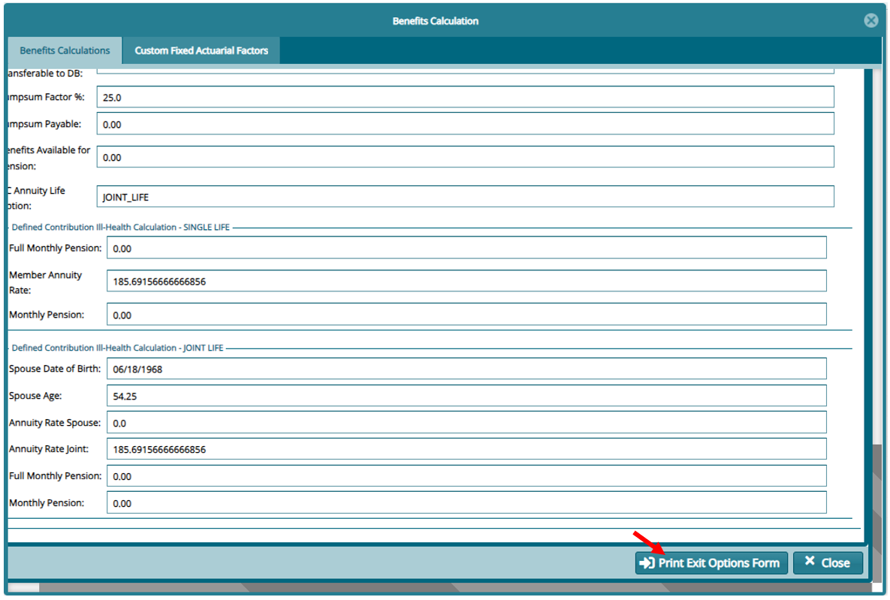

**GENERATING MEMBER EXIT OPTIONS FORM**

1.  From the Member Register, Select the member you wish to generate the exit form, click on the expert links on your right. Then click on **"Movements"** then **"Initiate Movement/Claim"**

2.  On the form that opens, input the details as required and click on **"Generate Member Exit Options"**

3.  Confirm the option to proceed with the calculation then on the window that opens confirm the calculation and click on **"Print Exit Options Form"**

On print a download option with pop up. Click on it and review the saved form before proceeding.

